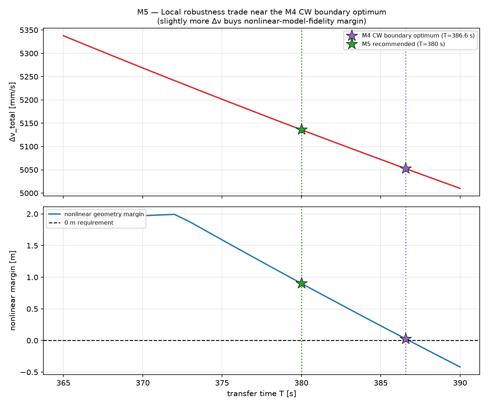
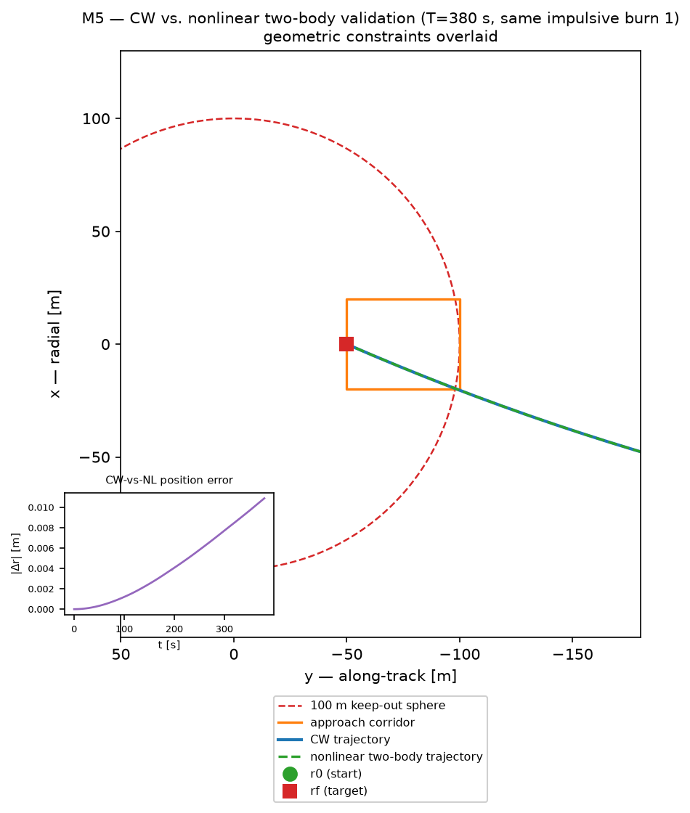

# Rendezvous & Proximity Operations Trade

**Final recommended transfer: 380 s, 5.136 m/s total Δv, +0.875 m CW keep-out/corridor
margin, +0.902 m nonlinear two-body margin.**

A from-scratch, test-verified Clohessy–Wiltshire (CW) relative-motion trade study for
a satellite-servicing rendezvous — carried from closed-form dynamics, through an
unconstrained Δv-vs-time trade, through proximity-operations geometric constraints, to
independent nonlinear two-body validation and a final robustness-driven
recommendation. 151 tests pass (`pytest -W error`).

## 1. Mission / problem statement

A servicing deputy spacecraft, holding 1000 m behind a chief on a 400 km circular LEO
orbit (with a 30 m out-of-plane offset), must transfer to a point 50 m behind the
chief with zero relative velocity, using two impulsive burns. The trade question:
**what transfer time minimizes total Δv, once (a) the CW two-impulse boundary-value
solution is numerically well-conditioned, (b) the coast trajectory avoids a 100 m
keep-out sphere except through an authorized approach corridor, and (c) the result
holds up against nonlinear two-body dynamics, not just the linearized model used to
design it?**

## 2. Final recommendation

| | |
|---|---|
| **Transfer time** | **T = 380 s** (T/P = 0.0684, ≈ 6.3 minutes) |
| **Design model** | CW linearized relative motion (closed-form STM, M2) |
| **Independent validation** | Nonlinear two-body propagation (M5) |
| **Total Δv (CW)** | **5.136023 m/s** (\|Δv1\| = 2.567899 m/s, \|Δv2\| = 2.568123 m/s) |
| **CW keep-out/corridor margin** | +0.875219 m |
| **Nonlinear keep-out/corridor margin** | +0.902241 m |
| **Nonlinear terminal position miss** | 0.0109 m (not corrected by any burn in this analysis) |
| **Nonlinear validation** | **passes modeled geometric constraints** |

## 3. Why the unconstrained Δv minimum was rejected

The pure Δv-vs-transfer-time trade (M3, `T ∈ [300, 5100] s`) found a global minimum at
**T ≈ 4868.130 s, Δv_total ≈ 163.457 mm/s** — far cheaper than the final
recommendation. But it was never evaluated against any proximity-operations geometry.
Once the 100 m keep-out sphere and V-bar approach corridor were applied (M4), this
transfer **failed**: it breaches the keep-out sphere well outside the authorized
corridor, *and* overshoots past the target along-track position before curving back —
a real safety problem the pure-Δv trade could not see, because it only ever checked
the two trajectory endpoints, never the continuous path.

The figure below makes this concrete: the M3 unconstrained minimum (✕ marker, far
right) and the M2 reference (●) are both geometry-rejected (red), and essentially the
entire unconstrained trade space is rejected — only a narrow band of fast transfers
(green, left edge) remains geometrically feasible at all.


## 4. Why the CW-only constrained optimum was superseded

Once geometry constraints were applied (M4), the cheapest transfer that still passed
was **T ≈ 386.564 s, Δv_total ≈ 5052.7 mm/s** — but only at an active-constraint
margin of **~15 micrometers**, a mathematical artifact of it being the exact boundary
of feasibility. M5 asked whether that razor's edge survives a higher-fidelity model.
It does — barely: nonlinear two-body propagation gives it a real margin of only
**~27.5 mm**, confirmed stable across sampling resolution and integrator tolerance (so
it is a genuine dynamical result, not numerical noise) — but 27.5 mm is still far
smaller than realistic navigation/actuation uncertainty. This result is labeled **"CW-
only constrained optimum — superseded by M5 robustness validation"**; it remains
fully documented as engineering history (`DESIGN.md` §14), just not the
recommendation.

## 5. Nonlinear two-body validation

M5 built an **independent** nonlinear model — inertial Cartesian two-body propagation
(`rddot = -mu*r/|r|^3`) for chief and deputy, integrated separately with
`scipy.integrate.solve_ivp` (DOP853), plus rigorous LVLH↔ECI frame kinematics
(including the rotating-frame `ω×r` term, without which the deputy's inertial
velocity would be wrong by ~1.1 m/s at this scenario's scale) — that never calls the
CW code it exists to check. Applying the *same* geometric-constraint classification
used in M4 to this independently-propagated trajectory is what produced the nonlinear
margins above. CW linearization error itself was quantified and shown to scale
approximately quadratically with separation (as expected for a first-order model) and
to grow with transfer time (~1 cm at fast M4-regime transfers, ~2.7 m at the M3
long-branch minimum).

## 6. Robustness-vs-Δv trade

|  | T = 386.564 s (CW-only optimum, superseded) | **T = 380 s (final recommendation)** | Δ |
|---|---:|---:|---:|
| CW Δv_total | 5052.7305 mm/s | 5136.0226 mm/s | **+1.65%** |
| CW margin | +0.0000155 m | +0.875219 m | 56,466× |
| Nonlinear margin | +0.027548 m | +0.902241 m | **~33×** |

**Spending 1.65% more Δv converts a microscopic, sampling-sensitive-looking margin
into a comfortable, meter-scale one.** This is the project's central engineering
conclusion, communicated in [`figures/m5_local_robustness_trade.png`](figures/m5_local_robustness_trade.png).




## 7. Verification evidence

Every closed-form equation, every solver, and every constraint check in this project
is backed by automated tests — 151 in total, `pytest -W error`, zero warnings:

- **CW STM (M2):** t=0 identity, ODE-residual, STM-composition, planar invariance,
  exact cross-track harmonic, time-reversal, and an *independent*
  `scipy.integrate.solve_ivp` cross-check of the raw CW ODE.
- **Two-impulse solver (M2):** terminal closure, burn reconstruction, trivial
  zero-transfer case, matches an independent hand calculation to <0.02 mm/s.
- **Trade sweep (M3):** grid-resolution convergence, sweep-order independence,
  singularity detection/exclusion verified on both sides of the boundary.
- **Geometric constraints (M4):** primitive classification tests, floating-point
  boundary tolerance, continuous-refinement-recovers-missed-minimum, corridor-entry
  sanity — plus one genuine bug found and fixed during development (documented, not
  hidden — `DESIGN.md` §14.8).
- **Nonlinear model (M5):** chief-orbit conservation (radius/energy/angular momentum),
  LVLH↔ECI round trips including the rotating-frame velocity term, CW small-time
  consistency, separation-scaling trend, integrator-tolerance convergence.
- **Reproducibility (M6):** re-verified in a genuinely fresh virtual environment with
  newer library versions — the T=380 s result reproduced bit-for-bit.

## 8. Limitations

This is a **CW-linearized, nonlinear-two-body-cross-checked geometric screening
study** — not a flight-qualification, collision-risk, or operational-safety analysis.
Explicitly not modeled anywhere in this project: J2, atmospheric drag, finite-duration
burns, thruster/actuator limits, navigation or sensor error, covariance/collision
probability, sensor field of view, line-of-sight Earth occultation, plume
impingement, or docking-contact dynamics. A transfer described as passing this
project's checks is **"geometrically feasible under modeled constraints, validated
against nonlinear two-body dynamics"** — never "collision-free", "flight-safe",
"operationally safe", or "flight-qualified". See `DESIGN.md` §1, §10, §14.10, §15.10,
and §16.6 for the full, restated-at-every-milestone scope statement.

## 9. Reproducibility / how to run

```bash
python3 -m venv .venv && source .venv/bin/activate
pip install -e ".[dev]"
pytest -W error                                    # 151 tests, ~1.5 s

python scripts/m2_plot_representative_transfer.py   # M2 diagnostic figure
python scripts/m3_trade_sweep.py                     # M3 CSVs + 3 figures
python scripts/m4_constrained_trade.py                # M4 CSVs + 3 figures
python scripts/m5_nonlinear_validation.py              # M5 CSVs + 3 figures
```

No randomness is used anywhere (the CW solver is closed-form arithmetic; the
nonlinear model is deterministic ODE integration), so every number above reproduces
exactly given the same inputs — confirmed in a from-scratch environment with newer
library versions (`DESIGN.md` §16.5).

## 10. Repository structure

```
├── DESIGN.md                    Full technical design doc: frame/sign conventions,
│                                 CW equations, STM, two-impulse method, hand
│                                 calculations, M2-M5 implementation/verification,
│                                 M6 final result hierarchy (§16), limitations
├── README.md                     This file
├── LICENSE                       MIT
├── pyproject.toml                Packaging; numpy+scipy runtime, pytest+matplotlib dev
├── .github/workflows/ci.yml      GitHub Actions: pytest on Python 3.11 and 3.12
├── src/rendezvous_cw/
│   ├── orbit.py                   Circular chief-orbit utilities (a, n, period)
│   ├── cw.py                       Closed-form CW STM blocks + propagate_cw()
│   ├── conditioning.py             Phi_rv determinant/condition-number diagnostics
│   ├── rendezvous.py                Two-impulse boundary-value solver
│   ├── trade.py                     Transfer-time/Δv trade-study utilities
│   ├── constraints.py               Keep-out sphere / approach corridor / no-crossing
│   │                                 geometric screening (CW trajectories)
│   └── nonlinear.py                 Independent nonlinear two-body model +
│                                     LVLH<->ECI frame kinematics (no CW reuse)
├── tests/                        151 tests covering the full M2-M5 verification plan
├── scripts/                      One figure/CSV-generation script per milestone
├── results/                      Decision tables + full sweeps (CSV) per milestone
└── figures/                      All milestone figures (see hierarchy below)
```

### Figure hierarchy

**Three principal portfolio figures — read together, they tell the whole story:**

1. [`m3_dv_vs_transfer_time.png`](figures/m3_dv_vs_transfer_time.png) *(cited here
   for the narrative; classified as supporting/history below — its own optimum is
   superseded)* **finds the unconstrained low-Δv solution** (T≈4868 s, ≈163.5 mm/s).
2. [`m4_constrained_dv_vs_transfer_time.png`](figures/m4_constrained_dv_vs_transfer_time.png)
   **shows that geometric constraints invalidate that optimum** — the keep-out
   sphere and approach corridor reject essentially the entire unconstrained trade
   space and force a fast transfer (T≲387 s) instead.
3. [`m5_cw_vs_nonlinear_trajectory.png`](figures/m5_cw_vs_nonlinear_trajectory.png) +
   [`m5_local_robustness_trade.png`](figures/m5_local_robustness_trade.png)
   **independently check the CW-constrained result against nonlinear two-body
   propagation and select T=380 s for robustness**, rather than the M4 boundary
   optimum (T≈386.6 s) that sits at essentially zero active-constraint margin.

(All three are shown inline above, in §3 and §6, at the point in the narrative where
each is most relevant — not repeated here to keep this reference list compact.)

**Supporting / diagnostic / milestone history** (real engineering history, kept in
the repository and fully documented in `DESIGN.md`, but **not** final-decision
figures — each is superseded or subordinate to the three above):

- [`m3_dv_vs_transfer_time.png`](figures/m3_dv_vs_transfer_time.png) — the
  unconstrained trade itself; its own T≈4868 s optimum is **superseded** once
  geometry constraints are applied (§3 above)
- [`m3_approach_trajectory_comparison.png`](figures/m3_approach_trajectory_comparison.png) —
  geometric path comparison across the unconstrained trade
- [`m3_conditioning_vs_transfer_time.png`](figures/m3_conditioning_vs_transfer_time.png) —
  Φrv singularity conditioning near P/2
- [`m4_approach_geometry.png`](figures/m4_approach_geometry.png) — M4's own selected
  trajectory (T≈386.6 s) vs. keep-out sphere/corridor; that transfer is itself
  **superseded** by the M5 T=380 s recommendation (§4 above)
- [`m4_constraint_margin_vs_transfer_time.png`](figures/m4_constraint_margin_vs_transfer_time.png) —
  keep-out clearance margin vs. transfer time
- [`m5_cw_error_vs_transfer_time.png`](figures/m5_cw_error_vs_transfer_time.png) —
  CW linearization error scaling across all representative cases
- [`m2_representative_transfer.png`](figures/m2_representative_transfer.png) — first
  verified CW trajectory (T=1800 s reference, used throughout as a fixed comparison
  point, never claimed optimal)

## 11. What this project demonstrates

- Deriving and independently verifying closed-form orbital-mechanics equations
  (Clohessy–Wiltshire STM) against multiple cross-checks, including a from-scratch
  nonlinear numerical model built specifically to *not* share code with the thing it
  validates.
- Turning a solver into an engineering trade study: transfer-time domain selection,
  singularity detection/exclusion policy (not just an absolute-value hack), and
  grid-resolution convergence evidence.
- Layering real-world operational constraints (keep-out zones, approach corridors)
  onto an idealized dynamics model, and being honest when the "optimal" answer fails
  them.
- Recognizing and quantifying model fidelity risk: a mathematically-exact constrained
  optimum can be operationally fragile, and a small, explicitly-costed Δv margin can
  buy real robustness — a genuinely non-obvious result that emerged from the analysis,
  not one assumed going in.
- Full-repository engineering hygiene: 151 passing tests, one documented and fixed
  bug, no dead code, consistent terminology, honest "superseded" labeling of earlier
  results, CI, and fresh-environment reproducibility — not just polish, but a
  demonstration that the numbers can be trusted.
