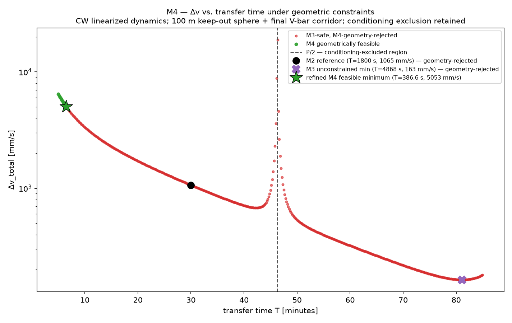
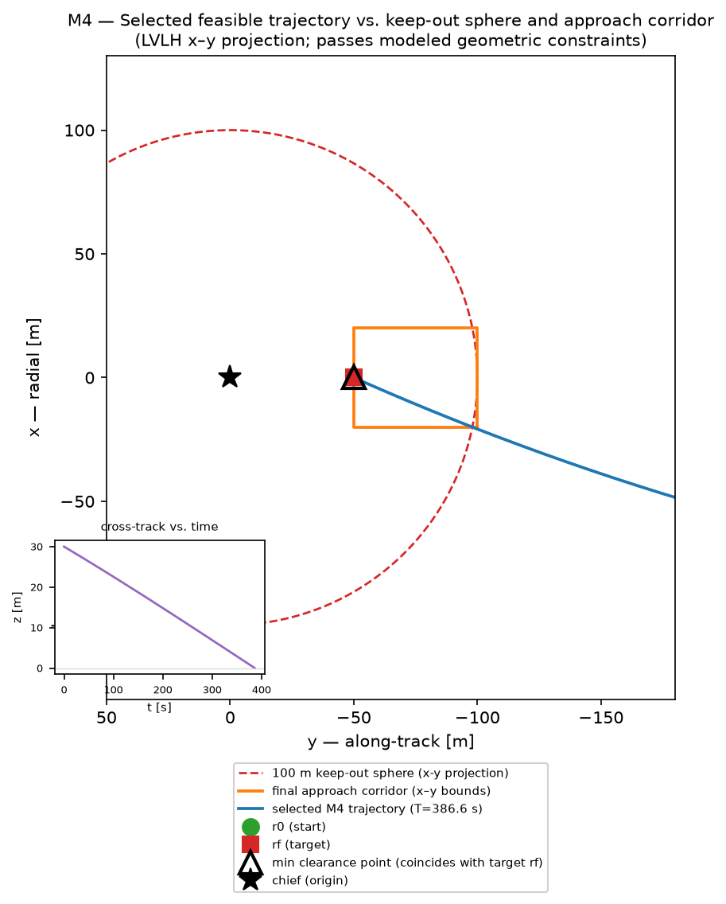

# Rendezvous & Proximity Operations Trade

A rigorously verified Clohessy–Wiltshire (CW) / Hill-frame relative-motion analysis
for a satellite-servicing rendezvous, culminating in:

1. an approach-trajectory plot, and
2. a Δv-vs-transfer-time trade table.

**Status: Milestone 4 complete.** Building on the unmodified, verified M2/M3 solver
and trade machinery, M4 adds proximity-operations **geometric screening**: a 100 m
keep-out sphere around the chief, a final V-bar approach corridor, and a
no-chief-crossing rule, checked continuously (not just at endpoints) along each
coast trajectory. 133 tests pass (`pytest -W error`).

**Key result: none of the M3 unconstrained minima survive the corridor constraint.**
Both the M2 T=1800 s reference and the M3 global minimum-Δv transfer (T≈4868 s) breach
the keep-out sphere outside the authorized corridor (the M3 minimum also overshoots
past the target along-track position — a real geometric problem the pure-Δv M3 trade
could not see). Only very fast transfers (T ≲ 387 s) thread the narrow corridor. The
refined **M4 minimum-Δv geometrically feasible transfer is T ≈ 386.56 s
(≈ 7.0% of the chief orbital period), Δv_total ≈ 5052.7 mm/s** — a **+375% penalty**
vs. the M2 reference and a **≈31× penalty** vs. the unconstrained M3 minimum. Full
detail, including why the corridor is so restrictive for these boundary conditions,
is in [`DESIGN.md`](DESIGN.md) §14.

**Headline figures:**




**Supporting figure:** [`figures/m4_constraint_margin_vs_transfer_time.png`](figures/m4_constraint_margin_vs_transfer_time.png)
(keep-out clearance margin vs. transfer time, with chief-crossing marked as a distinct
failure mode).

**Trade table:** [`results/m4_constrained_trade.csv`](results/m4_constrained_trade.csv)
(curated representative transfer times) and
[`results/m4_full_constrained_sweep.csv`](results/m4_full_constrained_sweep.csv)
(full sweep, reproducibility).

**Scope — read before citing any M4 result:** this is **linear-CW geometric screening
only**. A transfer described as "geometrically feasible under this CW model" is
**not** a claim of "collision-free", "flight safe", or "operationally safe" status.
Still not modeled: sensor field of view, Earth occultation, plume impingement, docking
dynamics, nonlinear two-body validation, J2/drag, finite burns, actuator limits, or
collision-risk probability.

**M3 status (still applicable, now geometry-screened):** the unconstrained
Δv-vs-transfer-time trade over `T ∈ [300, 5100] s` remains as documented — see
[`DESIGN.md`](DESIGN.md) §13, [`results/m3_transfer_trade.csv`](results/m3_transfer_trade.csv),
and [`figures/m3_dv_vs_transfer_time.png`](figures/m3_dv_vs_transfer_time.png) /
[`figures/m3_approach_trajectory_comparison.png`](figures/m3_approach_trajectory_comparison.png) /
[`figures/m3_conditioning_vs_transfer_time.png`](figures/m3_conditioning_vs_transfer_time.png).

## Model scope

Linearized relative motion about a **circular** chief orbit (Clohessy–Wiltshire / Hill
equations), in the **LVLH/Hill frame**, with **impulsive burns**. No J2, drag, finite
burns, nonlinear two-body propagation, keep-out-zone logic, docking dynamics, or
collision avoidance — see [`DESIGN.md` §1 and §10](DESIGN.md) for the full, explicit
scope statement and limitations.

## Scenario (summary — full detail in `DESIGN.md` §2)

- Chief: circular LEO, 400 km altitude (`n ≈ 1.1314e-3 rad/s`, period ≈ 92.56 min).
- Deputy starts holding 1000 m behind the chief on the V-bar, with a 30 m out-of-plane
  offset (3D scenario).
- Target: 50 m behind the chief on the V-bar, in-plane, zero relative velocity.
- Transfer time traded over `T ∈ [300 s, 5100 s]`.

## Repository layout

```
├── DESIGN.md                    Frame/sign conventions, CW equations, full STM,
│                                 two-impulse method, hand calculations, M2 solver
│                                 verification, M3 trade study, M4 geometric
│                                 constraints + feasible-minimum, verification plan,
│                                 limitations
├── README.md                     This file
├── pyproject.toml                Packaging + pytest configuration
├── src/rendezvous_cw/
│   ├── orbit.py                   Circular chief-orbit utilities (a, n, period)
│   ├── cw.py                       Closed-form CW STM blocks + propagate_cw()
│   ├── conditioning.py             Phi_rv determinant/condition-number diagnostics
│   ├── rendezvous.py                Two-impulse boundary-value solver
│   ├── trade.py                     M3 transfer-time/Δv trade-study utilities
│   │                                 (wraps the M2 solver; no equations duplicated)
│   └── constraints.py               M4 proximity-geometry screening: keep-out
│                                     sphere, approach corridor, no-chief-crossing
├── tests/                        133 tests covering the M2 + M3 + M4 verification plans
├── scripts/
│   ├── m2_plot_representative_transfer.py   Generates the M2 diagnostic figure
│   ├── m3_trade_sweep.py                     Generates the M3 CSV tables + figures
│   └── m4_constrained_trade.py               Generates the M4 CSV tables + figures
├── results/
│   ├── m3_transfer_trade.csv                 M3 curated decision table
│   ├── m3_full_sweep.csv                      M3 full sweep (reproducibility)
│   ├── m4_constrained_trade.csv               M4 curated decision table
│   └── m4_full_constrained_sweep.csv          M4 full sweep (reproducibility)
└── figures/
    ├── m2_representative_transfer.png        M2 diagnostic figure
    ├── m3_dv_vs_transfer_time.png             M3 headline figure
    ├── m3_approach_trajectory_comparison.png  M3 supporting figure
    ├── m3_conditioning_vs_transfer_time.png   M3 verification/supporting figure
    ├── m4_constrained_dv_vs_transfer_time.png M4 headline figure
    ├── m4_approach_geometry.png                M4 headline figure
    └── m4_constraint_margin_vs_transfer_time.png  M4 verification/supporting figure
```

## Development

```bash
python3 -m venv .venv && source .venv/bin/activate
pip install -e ".[dev]"
pytest -W error
```

## Roadmap

- **M1:** scenario definition, governing equations, closed-form STM, two-impulse
  method, hand calculations, verification plan. No solver code.
- **M2:** CW STM, Φrv conditioning policy, and two-impulse solver implemented and
  verified (92 tests) against the M2 verification plan and the M1 hand calculation.
  One diagnostic figure (`figures/m2_representative_transfer.png`).
- **M3:** Δv-vs-transfer-time trade study over `T ∈ [300, 5100] s` using the
  unmodified M2 solver; refined minimum-Δv transfer identified within the searched
  domain; decision table (CSV) and three figures. 15 new tests (107 total).
- **M4 (this milestone):** proximity-geometry screening (100 m keep-out sphere, final
  V-bar approach corridor, no-chief-crossing) layered on the unmodified M2/M3 solver;
  none of the M3 minima survive; refined minimum-Δv *geometrically feasible* transfer
  identified (T≈386.6 s, ≈31× the unconstrained M3 minimum's Δv); decision table (CSV)
  and three figures. 26 new tests (133 total). Geometric screening only — not a
  collision-risk or nonlinear flight-safety analysis.
- **M5 (next, pending approval):** nonlinear two-body validation, J2/drag, and/or
  finite-burn modeling — not yet scoped in detail.
