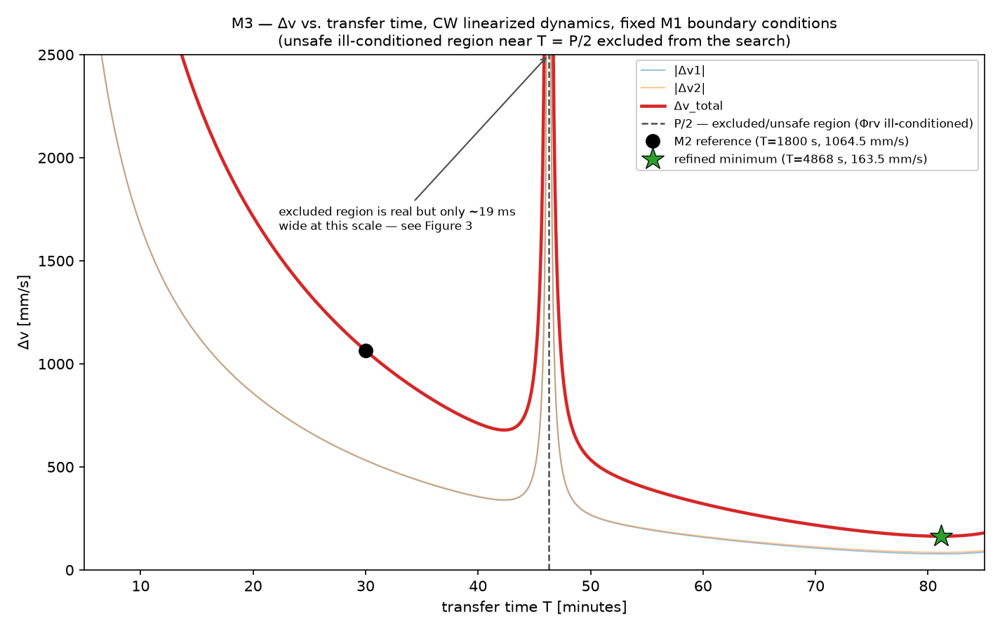

# Rendezvous & Proximity Operations Trade

A rigorously verified Clohessy–Wiltshire (CW) / Hill-frame relative-motion analysis
for a satellite-servicing rendezvous, culminating in:

1. an approach-trajectory plot, and
2. a Δv-vs-transfer-time trade table.

**Status: Milestone 3 complete.** Using the unmodified, verified M2 CW solver, a
Δv-vs-transfer-time trade study has been performed and verified (107 tests,
`pytest -W error`) over `T ∈ [300, 5100] s`. **Key result:** the lowest-Δv safe
transfer found in the searched domain is **T ≈ 4868.1 s (≈ 81.1 min, 87.7% of the
chief orbital period), Δv_total ≈ 163.46 mm/s — 84.6% lower than the M2 T = 1800 s
reference (1064.52 mm/s)**, at the cost of a ~2.7× longer transfer. Full detail,
including the disjoint-branch structure created by the interior half-period
singularity, is in [`DESIGN.md`](DESIGN.md) §13.

**Headline figure:**



**Supporting figures:** [`figures/m3_approach_trajectory_comparison.png`](figures/m3_approach_trajectory_comparison.png)
(geometric path comparison across four representative transfer times) and
[`figures/m3_conditioning_vs_transfer_time.png`](figures/m3_conditioning_vs_transfer_time.png)
(Φrv condition number near the T = P/2 singularity, verification/supporting).

**Trade table:** [`results/m3_transfer_trade.csv`](results/m3_transfer_trade.csv)
(curated representative transfer times) and
[`results/m3_full_sweep.csv`](results/m3_full_sweep.csv) (full sweep, reproducibility).

**Not modeled — still explicitly out of scope:** keep-out zones, approach corridors,
line-of-sight constraints, nonlinear two-body validation, J2/drag, finite burns,
actuator limits, collision-risk probability. The reported "minimum" is a Δv-minimizing
point of the linearized CW two-impulse problem over the searched time interval only —
**not** a claim of global optimality, fuel-optimality for a real spacecraft,
collision safety, or operational feasibility (see `DESIGN.md` §13.5 for the exact,
narrow scope of that word).

## Model scope

Linearized relative motion about a **circular** chief orbit (Clohessy–Wiltshire / Hill
equations), in the **LVLH/Hill frame**, with **impulsive burns**. No J2, drag, finite
burns, nonlinear two-body propagation, keep-out-zone logic, docking dynamics, or
collision avoidance — see [`DESIGN.md` §1 and §10](DESIGN.md) for the full, explicit
scope statement and limitations.

## Scenario (summary — full detail in `DESIGN.md` §2)

- Chief: circular LEO, 400 km altitude (`n ≈ 1.1314e-3 rad/s`, period ≈ 92.56 min).
- Deputy starts holding 1000 m behind the chief on the V-bar, with a 30 m out-of-plane
  offset (3D scenario).
- Target: 50 m behind the chief on the V-bar, in-plane, zero relative velocity.
- Transfer time traded over `T ∈ [300 s, 5100 s]`.

## Repository layout

```
├── DESIGN.md                    Frame/sign conventions, CW equations, full STM,
│                                 two-impulse method, hand calculations, M2 solver
│                                 verification, M3 trade study + refined minimum,
│                                 verification plan, limitations
├── README.md                     This file
├── pyproject.toml                Packaging + pytest configuration
├── src/rendezvous_cw/
│   ├── orbit.py                   Circular chief-orbit utilities (a, n, period)
│   ├── cw.py                       Closed-form CW STM blocks + propagate_cw()
│   ├── conditioning.py             Phi_rv determinant/condition-number diagnostics
│   ├── rendezvous.py                Two-impulse boundary-value solver
│   └── trade.py                     M3 transfer-time/Δv trade-study utilities
│                                     (wraps the M2 solver; no equations duplicated)
├── tests/                        107 tests covering the M2 + M3 verification plans
├── scripts/
│   ├── m2_plot_representative_transfer.py   Generates the M2 diagnostic figure
│   └── m3_trade_sweep.py                     Generates the M3 CSV tables + figures
├── results/
│   ├── m3_transfer_trade.csv                 Curated decision table
│   └── m3_full_sweep.csv                      Full sweep (reproducibility)
└── figures/
    ├── m2_representative_transfer.png        M2 diagnostic figure
    ├── m3_dv_vs_transfer_time.png             M3 headline figure
    ├── m3_approach_trajectory_comparison.png  M3 supporting figure
    └── m3_conditioning_vs_transfer_time.png   M3 verification/supporting figure
```

## Development

```bash
python3 -m venv .venv && source .venv/bin/activate
pip install -e ".[dev]"
pytest -W error
```

## Roadmap

- **M1:** scenario definition, governing equations, closed-form STM, two-impulse
  method, hand calculations, verification plan. No solver code.
- **M2:** CW STM, Φrv conditioning policy, and two-impulse solver implemented and
  verified (92 tests) against the M2 verification plan and the M1 hand calculation.
  One diagnostic figure (`figures/m2_representative_transfer.png`).
- **M3 (this milestone):** Δv-vs-transfer-time trade study over `T ∈ [300, 5100] s`
  using the unmodified M2 solver; refined minimum-Δv transfer identified within the
  searched domain; decision table (CSV) and three figures. 15 new tests (107 total).
- **M4 (next, pending approval):** keep-out zones / approach corridors / line-of-sight
  constraints, and/or nonlinear two-body validation — not yet scoped in detail.
